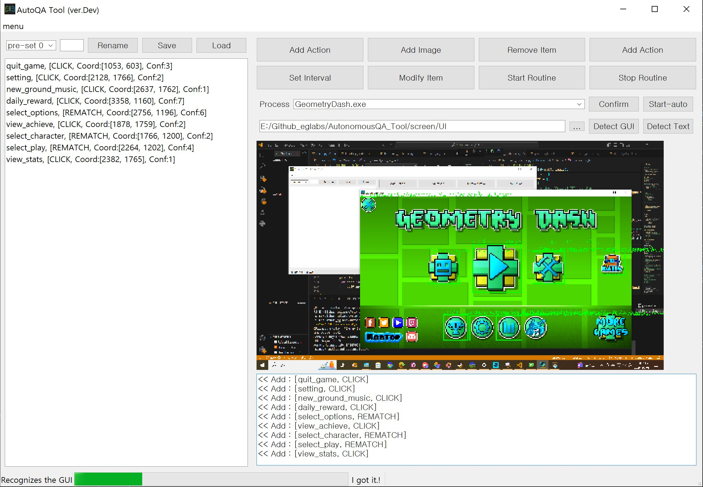
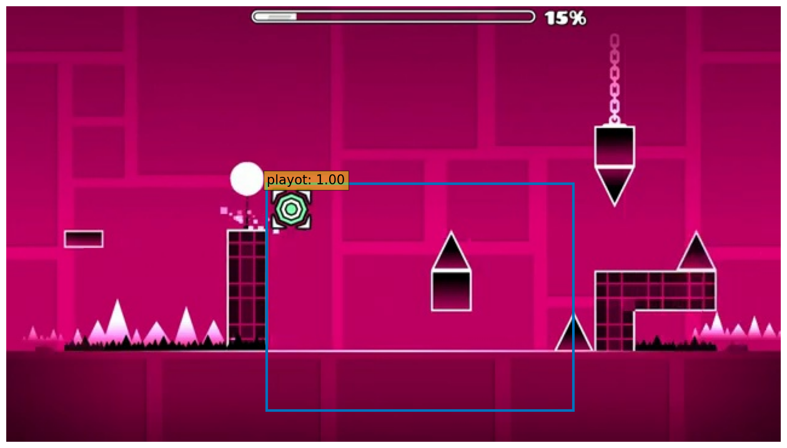
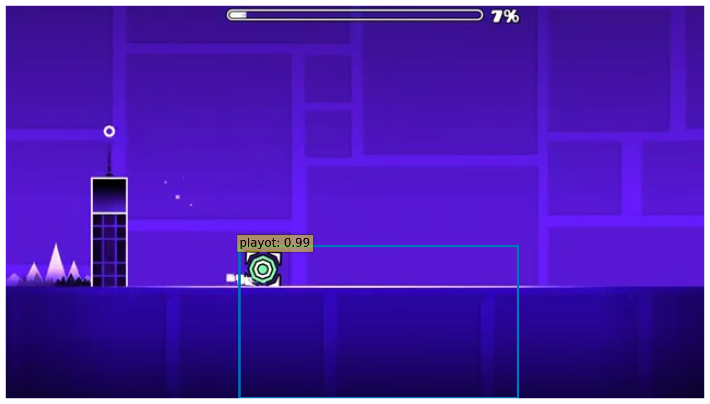

# AutonomousQA Tool

해당 Tool은 이미지를 기반으로 게임 Playing 이 가능한 QA Tool 입니다.

ㄴ 테스트 게임 : Geometry Dash

> [!Note]
> AutonomousQA Tool GUI
> 

> [!Note] 
> 이미지를 지정할 때는 어떠한 규칙성이 필요한데, 두가지로 나누어서 설명합니다.
> 1. GUI 기능에 맞는 네이밍 규칙
> 2. 기능에 따라 진행되는 GUI가 있다면, 새로운 GUI 폴더의 네이밍은 기능명을 그대로 적용
> 3. DETR(Detection Transformer) 에 player 캐릭터를 fine-tune
> - ( ex) into_scene.jpg -> into_scene/ ) 

## Trying to Finetuning DETR

## 개발환경

-Language : python 3.15.5

-GUI : Pyqt5

## Install

~~~sh
pip install -r requirements_win.txt
~~~

